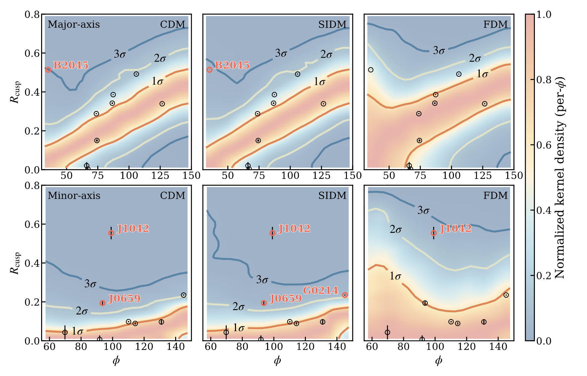

# CuspDM: Flux-Ratio Anomalies in Cusp-Configured Strong Lenses

[](https://arxiv.org/abs/2601.16818)

This repository provides a **forward-modeling and Bayesian inference framework** for studying **flux-ratio anomalies in cusp-configured strongly lensed quasars**.  
It is designed to compare predictions from different dark matter scenarios, including **CDM, SIDM, and fuzzy dark matter (FDM)**, using large ensembles of mock lens realizations.

The code implements macromodel-independent predictions of the normalized cusp relation,  
and enables robust statistical comparisons with observed microlensing-free flux-ratio measurements.

- **Authors**: Siyuan Hou, Shucheng Xiang, Yue-Lin Sming Tsai, Daneng Yang, Yiping Shu, Nan Li, Jiang Dong, Zizhao He, Guoliang Li, Yizhong Fan



---

## Data availability

The complete set of simulated data products is publicly available on Zenodo:

**DOI:** https://doi.org/10.5281/zenodo.18368466

## Requirements

The code is written in **Python** and relies on standard scientific packages.
Some components use [JAX](https://github.com/google/jax) for accelerated computations.

```shell
pip install numpy scipy matplotlib jupyter
pip install astropy tqdm
pip install lenstronomy pyhalo
pip install jax jaxlib
```


## Citation

If you use this code or the accompanying simulations, please cite:

Flux-ratio anomalies in cusp quasars reveal dark matter beyond CDM, https://doi.org/10.48550/arXiv.2601.16818

## Acknowledgments

- Interfaces leverage [`pyHalo`](https://github.com/dangilman/pyHalo) for substructure and line-of-sight halo modeling.
- M. S. H. Oh, A. Nierenberg, D. Gilman, and S. Birrer, Joint Semi-Analytic Multipole Priors from Galaxy Isophotes and Their Constraints from Lensed Arcs.
