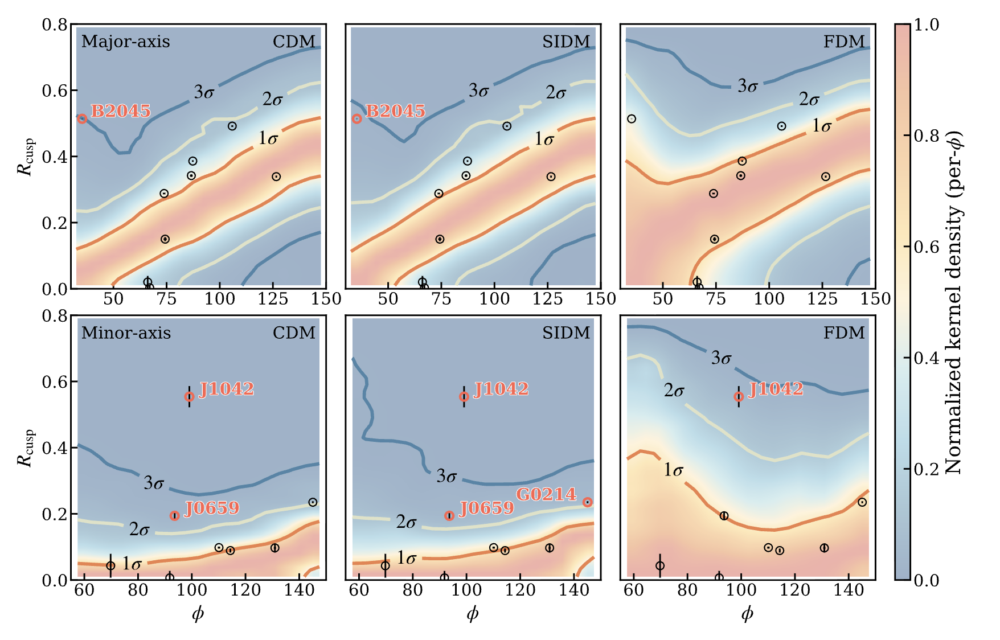
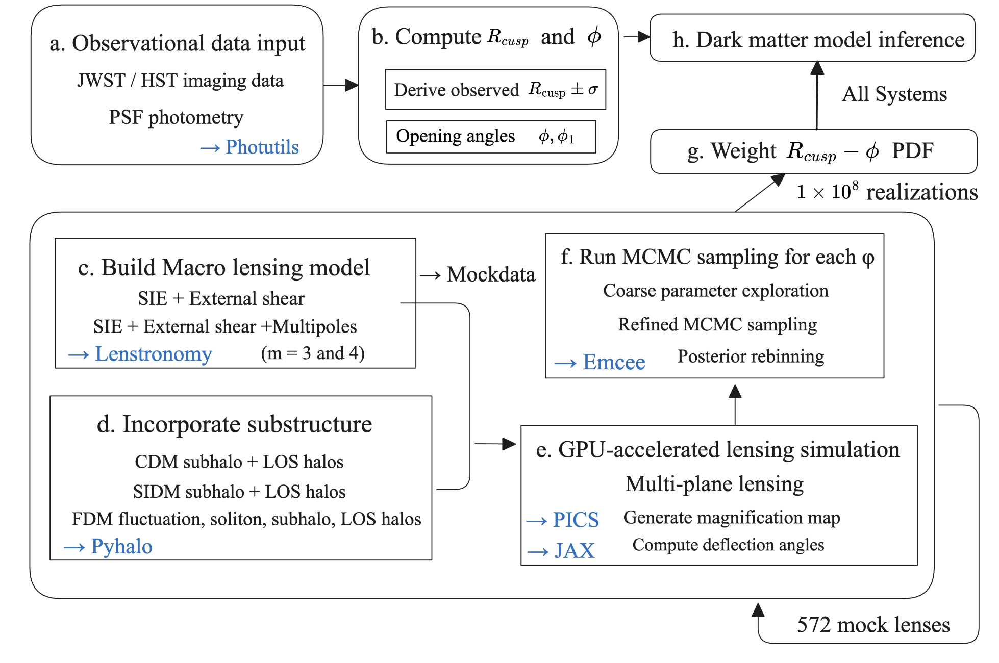

# CuspDM：尖点构型强引力透镜中的 Flux-Ratio 异常研究

[](https://arxiv.org/abs/2601.16818)

本代码仓库提供了一个 前向模拟（forward-modeling）与贝叶斯推断（Bayesian inference）框架，用于研究 尖点构型（cusp-configured）强引力透镜类星体中的 flux-ratio anomaly。

该框架旨在比较不同暗物质模型的理论预测，包括：
- 冷暗物质（CDM）
- 自相互作用暗物质（SIDM）
- 模糊暗物质（FDM）

通过生成大规模的模拟透镜样本（mock lens realizations），并与观测数据进行统计比较。

代码实现了 与宏观透镜模型无关（macromodel-independent）的 normalized cusp relation 预测，并能够与 去除微引力透镜效应（microlensing-free）的 flux-ratio 观测数据进行稳健的统计比较。

- 作者: Siyuan Hou, Shucheng Xiang, Yue-Lin Sming Tsai, Daneng Yang, Yiping Shu, Nan Li, Jiang Dong, Zizhao He, Guoliang Li, Yizhong Fan



---
 
# 数据获取

完整的模拟数据产品已公开发布在 Zenodo：

DOI:
https://doi.org/10.5281/zenodo.18368466

本文使用的观测数据（包括汇总的 cusp 构型引力透镜类星体 flux-ratio 数据）可以在以下链接获取：

Notion 数据库：
https://broken-yam-b18.notion.site/Lensed-Cusp-Quasar-2fffc9067a748018a1b0e1f13e404ae2

---

# 系统要求

操作系统均可

以下系统已完成测试：
- macOS（Apple M2 CPU）
- Linux + NVIDIA A100 GPU（CUDA 11）

Python推荐版本：

Python 3.10+

硬件要求（可选, 本地笔记本也可以,就是只能跑demo）
- NVIDIA GPU（CUDA）用于大规模模拟

---

## 软件依赖（测试版本）

Linux（A100, CUDA 11）：

```sh
python -m venv .venv
source .venv/bin/activate
pip install -r requirements-linux.txt
```
macOS（Apple M2 CPU）：
```sh
python -m venv .venv
source .venv/bin/activate
pip install -r requirements-macos.txt
```

---
# 代码原理 



- 详细内容见https://arxiv.org/abs/2601.16818 Method章节

# Demo 示例（小规模数据）

一个小规模示例已包含在：

运行步骤：

## 1. 下载SIE+External shear Mockdata 

Zenodo
https://zenodo.org/records/12739548

或

China-VO
https://nadc.china-vo.org/res/r101465/

对应论文：

Dong+2024
http://arxiv.org/abs/2407.10470

下载后放入：

Data/lensed_qso_mock.fits

## 2. 生成SIE+External shear+Multipole Mockdata

PS: 仅是随机挑出1000个lens计算

```sh
python demo/generate_multipule_mock_catalog.py

python lib/compute_lensing_for_mock_catalog.py \
  --sim-idx 0 \
  --num-sim 1000 \
  --fix 1 \
  --nnn 1000 \
  --fits demo/Data/lensed_qso_mock_multipole_temp.fits

python lib/merge_calc_results_to_fits.py \
  --fits demo/Data/lensed_qso_mock_multipole_temp.fits \
  --json-dir demo/Data/Data_json \
  --out-fits demo/Data/lensed_qso_mock_multipole.fits
```
输出结果

运行完成后将得到：
	•	demo/Data/Data_json/
中间计算生成的 JSON 文件
	•	demo/Data/lensed_qso_mock_multipole.fits

## 3. 筛选出Cusp系统
```sh
python lib/select_cusp_lens_systems.py \
  --fits demo/Data/lensed_qso_mock_multipole.fits \
  --out-fits demo/Data/cusp_all_observable_multipole.fits
```

PS: Demo样本太少, 挑不出Cusp, 运行后的结果将是0, 如需获得输出, 需用Full_Simulation, 后续结果计算需下载 Data/cusp_all_observable_multipole.fits, Data/cusp_all_observable.fits, 下载后可从demo/inspect_catalog_structure.ipynb检查文件结果

输出: 
合并后的透镜系统 catalog
- demo/Data/cusp_all_observable_multipole.fits--筛选出的 cusp 构型系统


## 4. Dark matter Lensing Lightcone 生成与 MCMC cusp 撒点 

ps: 由于计算量大,此demo仅随机挑选2个lensystem做测试
```sh
python demo/run_two_mock_systems.py \
  --fits demo/Data/cusp_all_observable_multipole.fits \
  --num-systems 2 \
  --mode both
```

说明：

Apple 建议默认使用 CPU：

```
python demo/run_two_mock_systems.py --mode both --compute cpu
``` 

### 单独测试lightcone


lightcone运行时间(Apple M2 CPU):
  - FDM：约 10 分钟 / 系统
  - CDM/SIDM：约 15 分钟 / 系统
  - MCMC 一个phibin 


实际运行时间取决于：子晕数量, 硬件性能

### 单独测试 MCMC 撒点

```
python demo/run_two_mock_systems.py --mode mcmc_each_phi --indices xx --compute cpu
```

注意此处运行时间较长, 一个phibin 需要10min+,测试设备Apple M2 CPU


## 5. 贝叶斯分析

合并最终结果 

```
python demo/Organizing_Rcusp_phi.py
```

最后生产出各个暗物质模型的最终Rcusp-phi数据文件merged_by_axis_type.pkl

后续贝叶斯分析使用已经完成的模拟示例, 下载Full Sample的模拟数据 https://doi.org/10.5281/zenodo.18368466 , 将得到的merged_by_axis_type.pkl和merged_by_axis_type_mul.pkl放入Data, 之后移步到Paper_image文件夹中的Bey.ipynb进行分析, 该notebook绘制了https://arxiv.org/abs/2601.16818 中贝叶斯分析的结果

⸻

# Full Sample模拟流程

完整模拟将耗费大量时间和计算资源，建议在具有 NVIDIA GPU（CUDA）的 Linux 系统上运行。

完整模拟运行时间

典型运行时间：
- Light-cone 生成（4×A100 GPU）：约 2 天
- MCMC 统计 Rcusp–phi 分布：约 3 周


## 1. 下载SIE+External shear Mockdata

- 过程同demo

---

## 2 生成多极矩 mock catalog

```
python Run_Full_Simulation/generate_multipule_mock_catalog.py
```

---

## 3 Light-cone 模拟

```
bash Run_Full_Simulation/run_lightcone.sh
```

---

## 4 每个 phi bin 进行 MCMC

```
bash Run_Full_Simulation/run_MCMC_each_phi.sh
```


## 在用户数据上的使用方法

准备一个与Data/cusp_all_observable.fits 结构类似的 FITS catalog。之后按照上述模拟流程进行即可


# 可重复性说明

提供了示例 notebook绘制 https://arxiv.org/abs/2601.16818 中的所有图像：位于Paper_image文件夹中
使用时需从 https://doi.org/10.5281/zenodo.18368466 下载所有文件并放置于Data


如果需要完全复现数据, 需要运行完整模拟流程。

---

# 引用

如果使用本代码或模拟数据，请引用：

Flux-ratio anomalies in cusp quasars reveal dark matter beyond CDM
https://doi.org/10.48550/arXiv.2601.16818

---

许可证与代码发布

许可证：MIT License （见 LICENSE 文件）


---

# 致谢


pyHalo: 用于子结构和视线 halo 建模：https://github.com/dangilman/pyHalo

多极钜相关参考工作：M. S. H. Oh, A. Nierenberg, D. Gilman, S. Birrer
Joint Semi-Analytic Multipole Priors from Galaxy Isophotes and Their Constraints from Lensed Arcs

